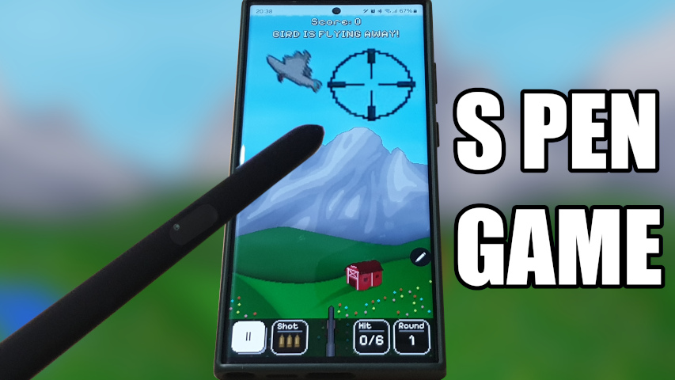
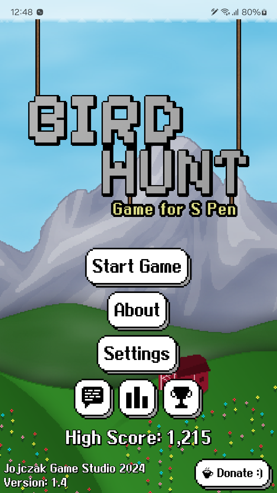
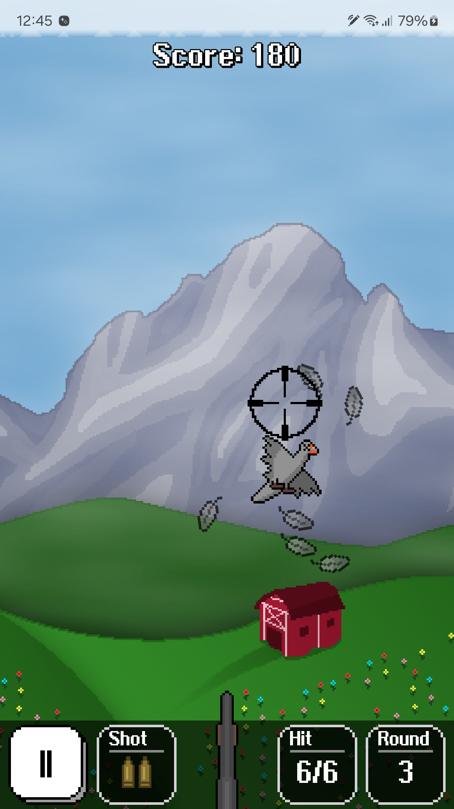
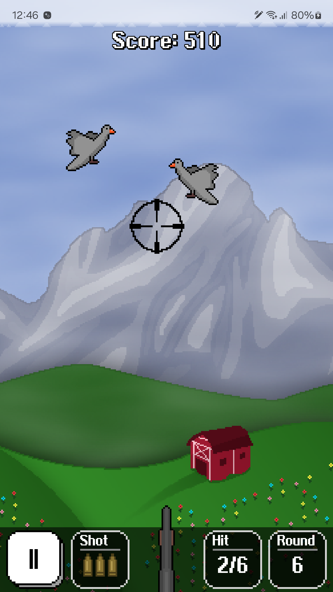
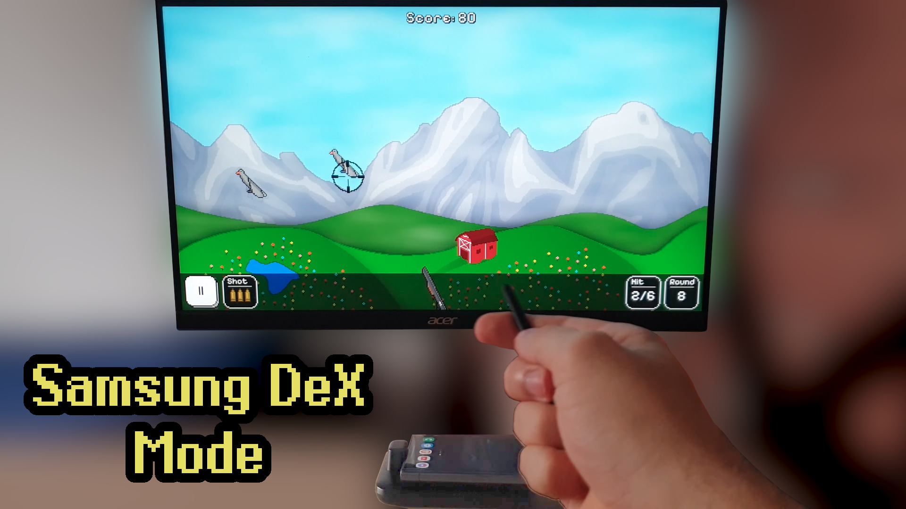

<p align="center">
  
</p>

# Bird Hunt
Bird Hunt is an attempt to create a simple game using the [S Pen Remote SDK](https://developer.samsung.com/galaxy-spen-remote/s-pen-remote-sdk.html). The game takes advantage of the gyroscope in the S Pen, available on certain Galaxy devices, to move the crosshair, simulating the effect of aiming a gun at the phone’s screen.

This game is more of a Proof of Concept/Tech Demo rather than a full-fledged game. The S Pen wasn't really designed for motion controls in games, so expect some bugs related to controls, random disconnects, and other issues. The S Pen SDK used here was last updated by Samsung 5 years ago, and they've removed this functionality in their latest devices. So if the game isn't working properly on your Galaxy device now, unfortunately, it's never gonna work any better.

The game was written in Kotlin using the [libGDX framework](https://github.com/libgdx/libgdx)

## Gameplay
The gameplay is inspired by the classic [Duck Hunt](https://en.wikipedia.org/wiki/Duck_Hunt) from Intelligent Systems for the NES platform.

During each round, a bird flies across the screen, and the player's goal is to aim and shoot it using the S Pen’s motion controls. The player has three bullets in the shotgun, which are replenished after successfully shooting a bird. If the player misses all three shots, the game ends. The player also needs to act quickly, as the bird will fly away after 7 seconds, resulting in a loss.

Every 6 birds you hit, a new round begins - each one faster and more challenging than the last. As you progress, more birds will appear on the screen, and they'll start moving even quicker.

You can see a demonstration of the game in this video:</br>
[](https://youtu.be/qkLsl1_ogis)

## Supported devices
<ins>**This game works ONLY on Samsung phones that have an S Pen with [Air Actions](https://www.samsung.com/us/support/answer/ANS10003221/) functionality.**</ins> Even if your device has a stylus but is not a Samsung device, the game will not work, as it uses Samsung's SDK specifically for S Pen.
- Samsung Galaxy Note Series: **Galaxy Note10**
- Samsung Galaxy S Ultra Series: **Galaxy S20-S24 Ultra**
- Samsung Galaxy Tab Series: **Galaxy Tab S6** and newer *(Air Actions depend on the specific S Pen model)*

It also requires Android 12 or newer.<br>
But like I said earlier, whether the game works on your device is kinda random. It might, but it also might not.

## Download
You can download Bird Hunt from the [Releases](https://github.com/jojczak/BirdHunt/releases) section here on GitHub or from Google Play:

[](https://play.google.com/store/apps/details?id=pl.jojczak.birdhunt)

## Building the Project
1. Clone the repository:
   ```bash
   git clone https://github.com/jojczak/BirdHunt.git
   ```
2. Open Android Studio and click `File > New > Import Project` and select the BirdHunt repository folder.
3. Select the android module from the run configurations dropdown and click the Run button

Repository also includes an LWJGL module, which allows you to run the game on a computer as a regular Java application. You can aim using the mouse in this mode.

## Screenshots
   

## Legal
The font used in game is [Generic Mobile System](https://www.dafont.com/generic-mobile-system.font) by Jayvee Enaguas</br>
All sound effects are from [Pixabay](https://pixabay.com/)</br>
libGDX cross-platform Java game development framework: [https://libgdx.com/](https://libgdx.com/)</br>
S Pen Remote SDK: [https://developer.samsung.com/galaxy-spen-remote/s-pen-remote-sdk.html](https://developer.samsung.com/galaxy-spen-remote/s-pen-remote-sdk.html)

"Samsung" and "S Pen" are registered trademarks of Samsung Electronics Co., Ltd.</br>
This game is not affiliated with, endorsed, or sponsored by Samsung Electronics Co., Ltd.
